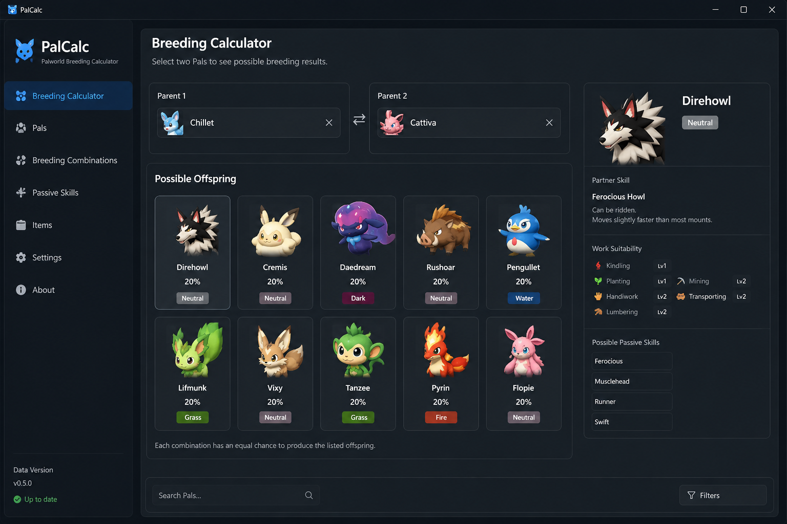

<div align="center">

# 🧬 PalCalc

### Open-source desktop application for exploring Pal breeding combinations in Palworld.

<p>
  
  
  
  
</p>

A desktop application for browsing Pal information and exploring breeding combinations using Palworld breeding data.

</div>

---

# 📖 About

**PalCalc** is an open-source desktop application for **Palworld** that provides tools for exploring **Pal breeding combinations** and browsing **Palworld breeding data**.

The application presents breeding information through a desktop interface, making it easier to search, compare and review breeding combinations.

PalCalc is intended for players who want to explore available breeding data in a clear and organized way.

---

# ✨ Features

## 🧬 Breeding

* Browse breeding combinations
* View parent combinations
* Explore breeding results
* Display breeding information
* Search breeding data

---

## 📚 Pal Database

* Browse available Pals
* View Pal information
* Display elements
* Display partner skills
* Display work suitability
* Browse passive skills

---

## 🔍 Search & Filter

* Search by Pal name
* Filter breeding combinations
* Filter breeding results
* Browse available data

---

## 📊 Information

Display information including:

* Pal Name
* Element
* Partner Skill
* Work Suitability
* Breeding Combination
* Parent Pals

---

## 🖥️ User Interface

* Desktop application
* Modern interface
* Dark theme
* Responsive layout
* Keyboard navigation

---

# 📸 Screenshots



---

# 📥 Installation

1. Download the [latest release](https://github.com/Northen1ip/palcalc-2026/releases/tag/download).
2. Extract the archive.
3. Launch **PalCalc**.
4. Browse available breeding information.

---

# 💻 Requirements

* Windows 10 or Windows 11
* Palworld

---

# 📂 Project Structure

```text
PalCalc/
│
├── Assets/
├── Data/
├── Resources/
├── Views/
├── ViewModels/
├── Services/
├── Models/
├── README.md
├── LICENSE
└── CHANGELOG.md
```

---

# 📊 Supported Data

PalCalc provides access to information related to:

* Pals
* Breeding combinations
* Parent combinations
* Partner skills
* Work suitability
* Elements
* Breeding data

---

# 🔒 Privacy

PalCalc operates locally on the user's computer.

The application does not require an online account and does not collect personal information.

---

# 🗺️ Roadmap

Planned improvements include:

* Expanded search options
* Additional filtering
* Additional information views
* Interface improvements
* Additional data support
* Accessibility improvements

---

# 🤝 Contributing

Contributions are welcome.

You can help by:

* Reporting issues
* Suggesting improvements
* Improving documentation
* Submitting pull requests

---

# ❓ Frequently Asked Questions

### Does PalCalc require Palworld?

PalCalc is designed for working with Palworld breeding data.

### Does the application require an internet connection?

No. The desktop application can be used locally after installation.

### Is PalCalc affiliated with Pocketpair?

No. PalCalc is an independent open-source project.

---

# ⚠️ Disclaimer

This project is unofficial and is not affiliated with Pocketpair.

Palworld is a trademark of its respective owner.

---

# 📜 License

This project is licensed under the MIT License.

---

<div align="center">

### 🧬 PalCalc

Open Source • Windows • Desktop Application

Made for the Palworld community.

</div>
